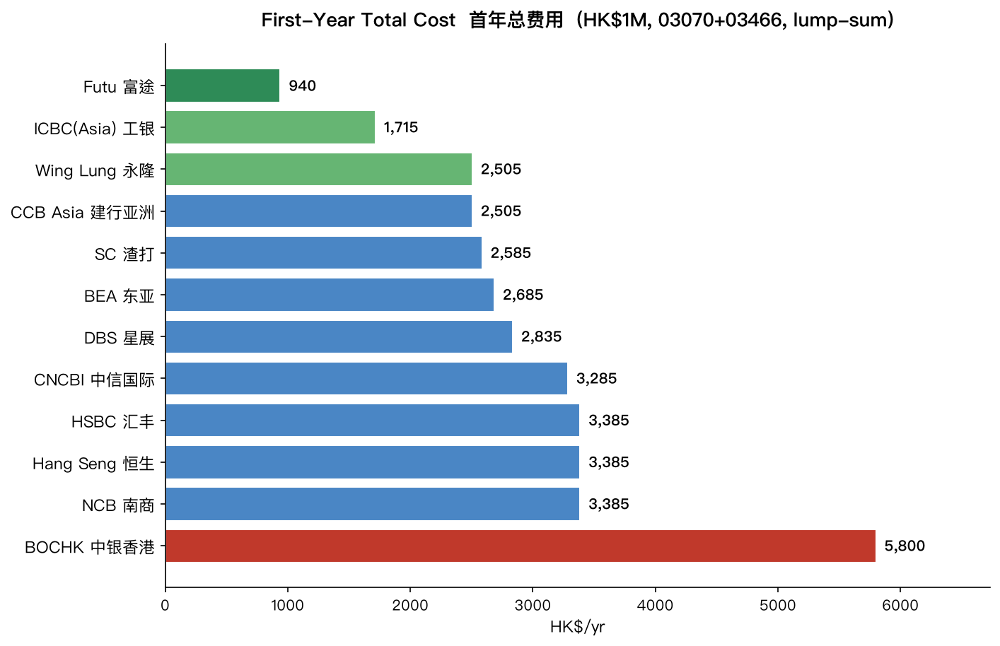
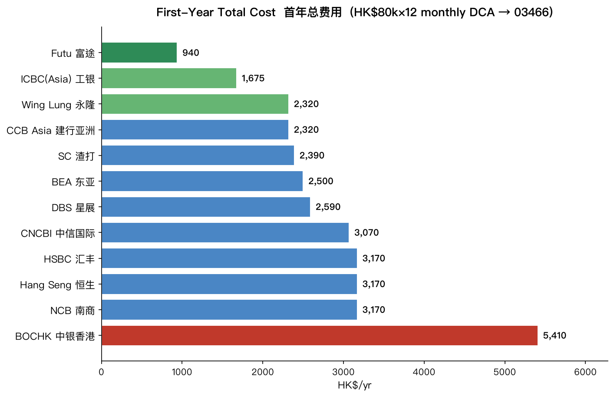
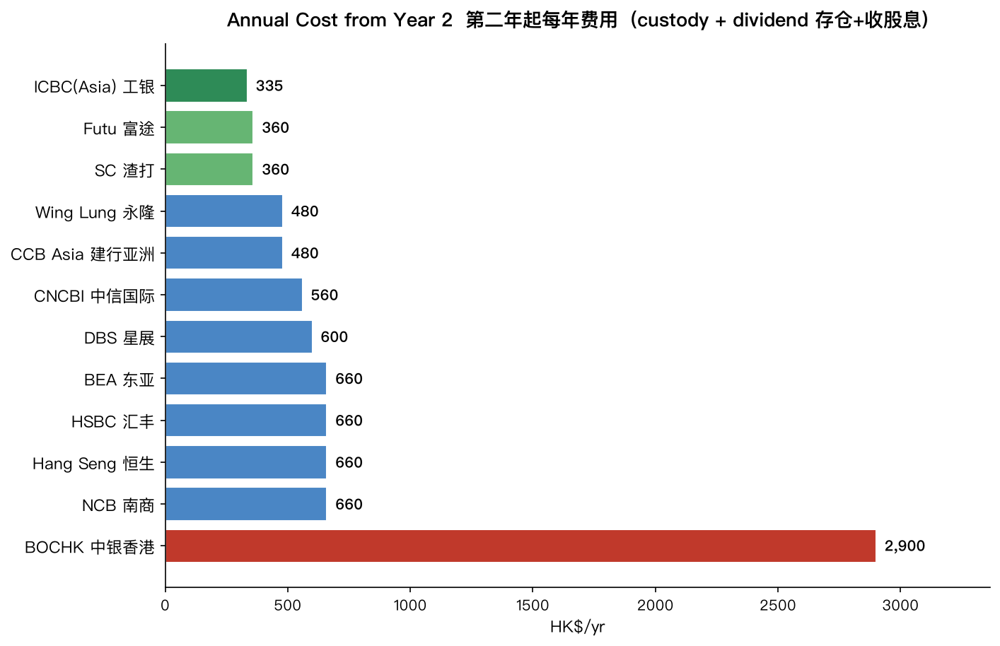
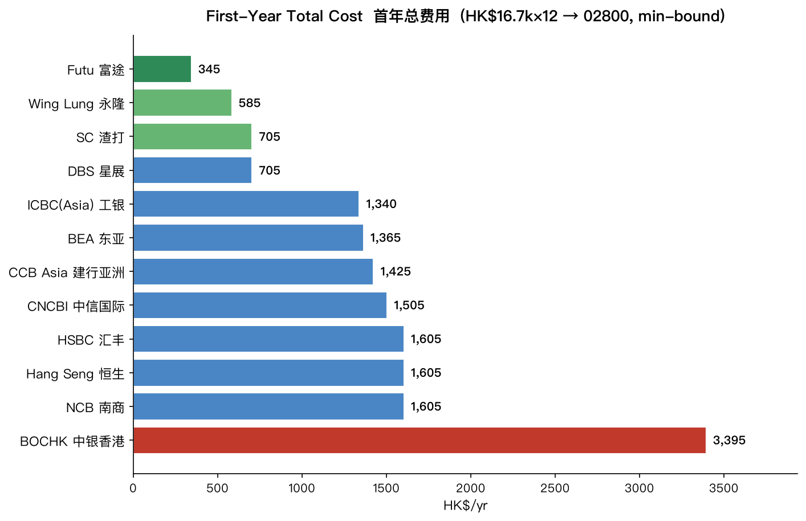
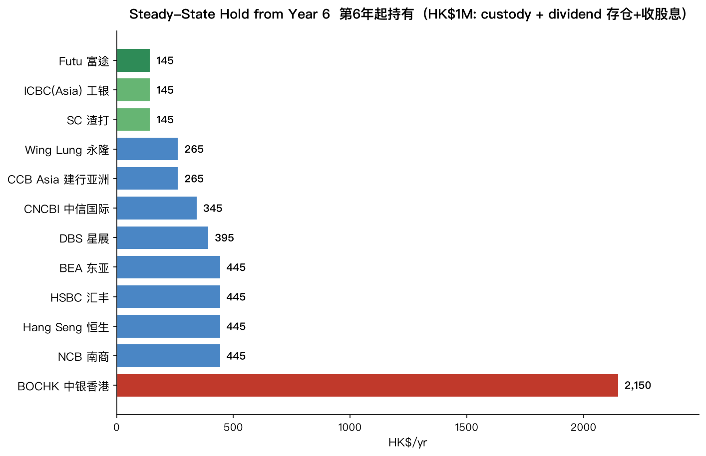

# Hong Kong Bank Cost Comparison for Dividend-ETF Investing
# 港股分红 ETF 投资：5 家香港银行全年成本对比

> **Language / 语言:** [English](#english) · [中文](#中文)
> **Last updated / 更新:** 2026-06-16 · all fees verified against each bank's **latest official schedule** (see [Sources](#sources--数据来源)).
> **Disclaimer:** Educational cost estimate — **not** financial, tax, or investment advice. Fees and promotions change; confirm with each bank before acting.

---

## ⚡ Scenario quick-reference / 场景速查表

| # | Scenario / 场景 | Cheapest / 最省 | Key reason / 关键原因 |
|---|---|---|---|
| **A** | 2 ETFs, HK$40k/mo DCA (small trades) / 两只ETF月供小额 | **ICBC ≈ SC** (~HK$1,400/yr) | ICBC's HK$20 dividend min + custody waived; SC unconditional custody |
| **B** | Single ETF, long-term hold / 单只ETF长揸 | **SC Priority / ICBC Wealth** | Only these waive custody **unconditionally** once you stop trading |
| **C** | 1 ETF + 2 bank stocks, HK$500k / 1ETF+2银行股 | Yr1 **SC≈ICBC≈WL**; hold **SC** | Few large dividends → fee similar; custody decides long-term |
| **D** | One holding, HK$500k / 三选一全仓50万 | Stock **SC/WL** · ETF **ICBC** | Bank-stock dividend fee equal at all banks; monthly ETF → ICBC min $20 |
| **E** | One holding, HK$800k (~HK$66k/trade) / 全仓80万 | **ICBC (Wealth a/c)** | 0.138% beats 0.20% at big trades; HK$800k unlocks ICBC Wealth |
| **F** | HK$3M anti-sanctions (gold+USD+stock) / 抗制裁300万 | **ICBC (Wealth a/c)** | 0.1% ≥HK$1M tier + unconditional custody; gold & USD have no dividend fee |
| **G** | **12 institutions**, HK$1M (03070+03466) / 12家全机构 | Yr1 **Futu** · hold **ICBC Wealth** | Broker beats banks on commission; ICBC's HK$20 div-min + free custody win long-term; **BOCHK worst** |
| **H** | **12 institutions**, single ETF 03466, HK$80k/mo DCA (12 trades) / 12家·单只ETF月供大额 | Yr1 **Futu** (banks: **ICBC**) · hold **ICBC-Wealth ≈ SC ≈ Futu** (~HK$340–360) | HK$80k/trade → no min binds → **rate decides** (ICBC 0.138%); Yr2+ ICBC's div-min edge fades → 3-way tie; **BOCHK worst** |
| **I** | **12 institutions**, single ETF 02800, HK$16.7k/mo DCA over 60 mo / 12家·单只ETF月供小额 | Yr1 **Futu** (banks: **Wing Lung / DBS / SC**) · hold **SC ≈ Futu ≈ ICBC-Wealth** (~HK$145) | **Mirror of H**: HK$16.7k/trade → **minimums bind** → low-min wins, **ICBC's HK$88 min now a liability** (mid-pack); 02800's 2 big dividends make div-fee equal → Yr6+ pure custody; **BOCHK worst** |

**Rule of thumb / 经验法则:** small trades → *minimums* dominate (low-min banks win); big trades → *rates* dominate (ICBC's 0.138% / ≥1M 0.1% wins); long-term hold → *custody* dominates (SC or ICBC-Wealth, unconditional $0). **BOCHK only with promos**, and worst for frequent small dividends (HK$75 min). / 小额拼最低收费、大额拼费率（工银）、长揸拼托管（渣打/工银理财金）；中银只在促销时考虑。

---

## English

### TL;DR — Full-year cost ranking

**Plan:** invest **HK$40,000/month**, alternating two dividend ETFs month by month (1 trade of HK$40,000 each month → 12 trades/year, ~HK$480k/year, ~14 dividend payouts/year).

**ETFs chosen:** **03466** (Hang Seng High Dividend 30) + **03437** (Bosera CSI SOE Dividend) — the two most *stable* and *cost-effective* of the five (both ~7% yield, genuine dividend-stock ETFs; excludes the covered-call 03416, the newly-restructured 03145, and the lower-yield 03070).

| Rank | Bank (tier) | Full-year cost | Why |
|------|-------------|---------------|-----|
| 🥇 | **ICBC (Asia)** | **≈ HK$1,401** | Lowest dividend fee (min HK$20) + free custody *(while trading — see caveat)* |
| 🥈 | **Standard Chartered — Priority** | **≈ HK$1,445** | Unconditional $0 custody, simplest |
| 🥉 | **CMB Wing Lung — Sunflower** | **≈ HK$1,469** | Lowest commission (0.18%) |
| 4 | **DBS — Treasures** | **≈ HK$1,645** | Custody min HK$100×2 + no commission edge |
| — | **BOCHK — Wealth Mgmt** | **≈ HK$1,115 (all promos) / ≈ HK$4,075 (standard)** | Cheap only while promos last; **worst dividend fee** |

**ICBC and SC are effectively tied (~HK$1,400)** and are the best *reliable* choices. **BOCHK is a gamble** — cheapest only if its promotions hold, but its dividend handling fee is permanently the highest.

### Verified fee schedule (online channel, June 2026)

| Bank (tier) | Commission | Custody / safekeeping | Dividend collection |
|-------------|-----------|----------------------|---------------------|
| **ICBC (Asia)** | **0.138%** (<HK$1M) / 0.1% (≥HK$1M) / **0.125%** (Wealth a/c); **min HK$88** | HK$0.15/board-lot per half-year, min HK$100 / max HK$2,500; **waived if 6-mo turnover ≥ HK$200k**; Wealth a/c waived | 0.5%, **min HK$20**, max HK$2,500 |
| **SC — Priority** | 0.20%, min HK$50 | **HK$0 (waived)** | 0.5%, min HK$30 |
| **Wing Lung — Sunflower** | 0.18%, **min HK$4.88/trade**, monthly cap HK$2,888 | HK$120/year (if holding) | 0.5%, min HK$30, max HK$2,000 |
| **DBS — Treasures** | 0.20%, **no minimum** | 0.025%/yr (accrued monthly), **min HK$100 / max HK$500 per half-yearly charge** | 0.5%, min HK$30, max HK$2,500 |
| **BOCHK — Wealth Mgmt** | Standard 0.25%–0.4% (min up to HK$400); **Monthly-Investment Plan HK$0 (promo to 2026-12-31)** | Standard HK$1,000/half-year; HK$0 under promo | 0.5%, **min HK$75**, max HK$6,500 |

> Account service fees: SC Priority's semi-annual account fee is **waived** when the minimum relationship balance is maintained (Priority requirement). DBS Treasures has no separate securities account fee beyond custody above.

### Cost breakdown (HK$40,000 × 12 trades, ~14 dividend payouts)

**① Commission** — at HK$40,000/trade, most minimums no longer bind; ICBC's HK$88 minimum still does.

| Bank | Per trade | × 12 |
|------|-----------|------|
| Wing Lung | 0.18% → HK$72 | **HK$864** |
| SC Priority | 0.20% → HK$80 | **HK$960** |
| DBS Treasures | 0.20% → HK$80 | **HK$960** |
| ICBC | 0.138%×40k = HK$55 → **min HK$88 binds** | **HK$1,056** |
| BOCHK | HK$0 (monthly-plan promo) / else ~HK$80 | **HK$0 / ~960** |

> ICBC's HK$88 minimum binds until a trade reaches **HK$63,768** (0.138%). At HK$40k it pays HK$88 — the *highest* commission here, despite the lowest rate.

**② Custody (per year)**

| Bank | Cost |
|------|------|
| ICBC | **HK$0** *while trading* (6-mo turnover HK$240k ≥ HK$200k → waived) — **~HK$200/yr once you stop trading**, unless on a Wealth a/c (see below) |
| SC Priority | **HK$0** (always waived) |
| Wing Lung | HK$120 |
| DBS Treasures | **HK$200** (min HK$100 × 2 charges; 0.025% of ≤HK$500k is below the minimum) |
| BOCHK | HK$0 (promo) / HK$2,000 (standard) |

**③ Dividend collection (~14 payouts × minimum, all hit the minimum in year 1)**

| Bank | Min/payout | × 14 |
|------|-----------|------|
| ICBC | HK$20 | **HK$280** |
| SC / Wing Lung / DBS | HK$30 | **HK$420** |
| BOCHK | HK$75 | **HK$1,050** |

**Total (+ ~HK$65/yr government & exchange fees — ETFs are stamp-duty exempt, identical for all):**

| Bank | Commission | Custody | Dividend | Gov | **Total** |
|------|-----------|---------|----------|-----|-----------|
| **ICBC (Asia)** | 1,056 | 0 | 280 | ~65 | **≈ 1,401** |
| **SC Priority** | 960 | 0 | 420 | ~65 | **≈ 1,445** |
| **Wing Lung** | 864 | 120 | 420 | ~65 | **≈ 1,469** |
| **DBS Treasures** | 960 | 200 | 420 | ~65 | **≈ 1,645** |
| **BOCHK** | 0 / 960 | 0 / 2,000 | 1,050 | ~65 | **≈ 1,115 / 4,075** |

### Key insights

1. **Trade size flips the ranking.** With *small* trades (e.g., HK$8,000), per-trade minimums dominate and no-minimum banks win. With *large* trades (HK$40,000 here), commissions converge and the **dividend fee + custody** decide it.
2. **ICBC's minimum still bites.** Its great 0.138% rate is wasted below HK$63,768/trade — at HK$40k it pays the HK$88 minimum. Its win comes from the **lowest dividend fee (HK$20)** + free custody.
3. **BOCHK's dividend fee is the structural killer.** 0.5% with a **HK$75 minimum** (vs HK$20–30) — never waived by any promo. A HK$560 monthly dividend costs HK$75 to collect (**13.4%** eaten).

### Optimization

ICBC's HK$88 minimum binds below HK$63,768/trade. Buying ICBC's ETF **every 2 months at HK$80,000** instead of monthly:
- Commission: 0.138% × HK$80k = HK$110/trade × 6 = **HK$660** (down from HK$1,056)
- **ICBC total ≈ HK$1,005 — a clear #1.**
- Other banks charge commission linearly on turnover, so consolidating trades makes **no difference** to them (Wing Lung always 0.18%×480k=864; SC/DBS 0.2%×480k=960).

### Single ETF & long-term holding — the custody-waiver caveat

**Important:** ICBC's free custody depends on **6-month turnover ≥ HK$200,000**. That holds *while you keep buying*, but **once you stop trading and just hold, the waiver lapses** and a regular ICBC account is charged custody (HK$0.15/board-lot, **min HK$100 × 2 = HK$200/year**). Only two options waive custody **unconditionally**:

| Account | Custody waived when idle (buy-and-hold)? |
|---|---|
| **SC Priority** | ✅ Always, no condition |
| **ICBC Wealth-Management account** | ✅ Unconditional (also cuts commission to 0.125%) |
| ICBC **regular** account | ❌ ~HK$200/year once turnover stops |
| Wing Lung Sunflower | ❌ HK$120/year |
| DBS Treasures | ❌ ~HK$200/year |
| BOCHK | ❌ ~HK$2,000/year standard (unless promo/tier waiver) |

**Long-term cost of a single ETF** (≈HK$480k held, no trading — only custody + dividend fee):

*Single **semi-annual** payer (e.g. 03437): large payouts, so 0.5% > every minimum → dividend fee ≈ HK$168 for all banks; **custody alone decides**:*

| Bank | Custody | Dividend | Total |
|---|---|---|---|
| **SC Priority / ICBC Wealth a/c** | 0 | 168 | **≈ HK$168** |
| Wing Lung Sunflower | 120 | 168 | ≈ HK$288 |
| ICBC regular / DBS Treasures | 200 | 168 | ≈ HK$368 |
| BOCHK | ~2,000 | 168 | ≈ HK$2,168 |

*Single **monthly** payer (e.g. 03466): small payouts hit the minimum 12×, so ICBC's HK$20 min helps:*

| Bank | Custody | Dividend (12×min) | Total |
|---|---|---|---|
| **ICBC Wealth a/c** | 0 | 240 (×$20) | **≈ HK$240** |
| **SC Priority** | 0 | 360 (×$30) | ≈ HK$360 |
| ICBC regular | 200 | 240 | ≈ HK$440 |
| Wing Lung Sunflower | 120 | 360 | ≈ HK$480 |
| DBS Treasures | 200 | 360 | ≈ HK$560 |
| BOCHK | ~2,000 | 900 (×$75) | ≈ HK$2,900 |

**Takeaways:**
- For a long-term single-ETF hold, use **SC Priority** (unconditional $0 custody) or an **ICBC Wealth-Management account** (unconditional + lowest dividend min). **Do not** treat a *regular* ICBC account as zero-custody once you stop trading (~HK$200/yr).
- Prefer a **semi-annual payer (03437)** over a monthly one (03466): fewer, larger payouts pay the true 0.5% (~HK$168) instead of hitting the per-payout minimum 12× (~HK$360). This also neutralises BOCHK's HK$75 minimum, which only bites on small/monthly payouts.

### Scenario C — 1 ETF + 2 bank stocks (stamp duty + long-term hold)

**Holdings:** 03437 (Bosera SOE Dividend ETF, semi-annual) + **03988 (Bank of China)** + **01398 (ICBC)** — the two banks are *stocks* (H-shares, ~6–7%, interim + final = 2 payouts/year each), **not ETFs**, so each buy pays **0.1% stamp duty** (ETFs are exempt).

**Plan:** HK$500,000 over **12 monthly buys (~HK$41,667 each), rotating** the three holdings (each bought ~4×). ~6 dividend payouts/year. *(Buying all 3 every month = 36 small trades, which triples ICBC's HK$88-minimum commission to ~HK$3,168 — avoid.)*

**Year 1 (deploying — 12 buys):**

| Bank | Commission | Custody | Dividend (~6×) | Gov + stamp duty | **Total** |
|---|---|---|---|---|---|
| **SC Priority** | 1,000 | 0 | ~180 | ~405 | **≈ 1,585** |
| **ICBC (Asia)** | 1,056 (min $88) | 0 | ~130 | ~405 | **≈ 1,591** |
| **Wing Lung Sunflower** | 900 | 120 | ~180 | ~405 | **≈ 1,605** |
| **DBS Treasures** | 1,000 | 200 | ~180 | ~405 | **≈ 1,785** |
| **BOCHK** | 0 / 1,000 | 0 / 2,000 | ~450 | ~405 | **≈ 855 / 3,855** |

**Year 2+ (holding HK$500k, no buying — commission & stamp duty fall away; ICBC's turnover-based custody waiver lapses):**

| Bank | Custody | Dividend | **Total/yr** |
|---|---|---|---|
| **SC Priority / ICBC Wealth a/c** | 0 | ~180 | **≈ 180** |
| **Wing Lung Sunflower** | 120 | ~180 | ≈ 300 |
| **ICBC regular account** | 200 | ~174 | ≈ 374 |
| **DBS Treasures** | 200 | ~180 | ≈ 380 |
| **BOCHK** | ~2,000 | ~450 | ≈ 2,450 |

**Notes:**
- Stamp duty (~HK$335/yr) applies only to the two bank *stocks*, not the ETF — identical across all banks.
- With few, large dividends the handling fee is small and similar for all — except **BOCHK**, whose HK$75 minimum still bites (~HK$450).
- **Deploying year:** SC ≈ ICBC ≈ Wing Lung (tied ~HK$1,590). **Long-term hold:** **SC Priority wins** (unconditional $0 custody); a *regular* ICBC account jumps to ~HK$374 once buying stops.

### Scenario D — concentrate on ONE holding (stock vs ETF)

Put all HK$500k into **one** of: a bank **stock** (01398 ICBC or 03988 Bank of China) **or** the **03466 ETF** (Hang Seng High Dividend 30). 12 monthly buys of ~HK$41,667.

**A single bank stock** (stamp duty applies; 2 large dividends/year):

*Year 1 (commission + dividend; + ~HK$504 stamp duty, same for all):*
| Bank | Commission | Dividend | Comm.+Div |
|---|---|---|---|
| **Wing Lung** | 900 | ~90 | **~990** |
| SC / DBS | 1,000 | ~90 | ~1,090 |
| ICBC | 1,056 | ~90 | ~1,146 |
| BOCHK | 0 / 1,000 | ~150 | ~150 / 1,150 |

*Year 2+ (annual dividend fee):* **~HK$175 for ALL 5 banks** — the two large payouts pay the true 0.5%, so even BOCHK's HK$75 minimum doesn't bind. The choice then comes down to **custody** (SC / ICBC-Wealth $0; Wing Lung 120; ICBC-regular / DBS 200; BOCHK ~2,000).

**The 03466 ETF** (no stamp duty; 12 small monthly dividends → minimum binds):

*Year 1 (commission + dividend; no stamp duty):*
| Bank | Commission | Dividend (12×min) | Comm.+Div |
|---|---|---|---|
| **Wing Lung** | 900 | 360 | **1,260** |
| ICBC | 1,056 | 240 | 1,296 |
| SC / DBS | 1,000 | 360 | 1,360 |
| BOCHK | 0 / 1,000 | 900 | 900 / 1,900 |

*Year 2+ (annual dividend fee):* ICBC **HK$240** · SC / Wing Lung / DBS **HK$360** · BOCHK **HK$900**.

**Takeaways:**
- **Stock vs ETF:** a stock pays ~HK$504/yr stamp duty *while buying* but only ~HK$175/yr dividend handling forever (same at every bank); the monthly ETF pays no stamp duty but HK$240–900/yr handling. Long hold → the stock is slightly cheaper on fees; short hold → the ETF.
- **For a bank stock, BOCHK's dividend penalty disappears** (large payouts clear the HK$75 minimum) — its only problem is custody.
- **No "parent-stock" discount:** buying 01398 through ICBC (Asia) or 03988 through BOCHK is charged the *same* standard securities fees as any HK stock.

**Account thresholds (verified):**
- **SC Priority** minimum: **HK$1,000,000** average daily balance (not HK$500k). Below it (after the waiver period) the account service fee is **~HK$900/quarter (~HK$3,600/yr)** — but that is a *banking* fee; a non-Priority SC account still gets $0 securities custody, so it is avoidable.
- **ICBC (Asia) Wealth-Management (Elite Club) account:** ~**HK$800,000** average relationship value (official tier table; confirm current figure). With only HK$500k you likely won't qualify, so ICBC custody would **not** be unconditionally waived for a long hold.

### Scenario E — HK$800k principal, one holding (trade size flips the ranking)

Put all **HK$800,000** into **one** of: 03466 (Hang Seng High Dividend 30 ETF) / 01398 (ICBC) / 03988 (Bank of China). **12 monthly buys of ~HK$66,667.**

**Why this is different from HK$500k:**
1. At **HK$66,667/trade, ICBC's 0.138% = HK$92** — *above* the HK$88 minimum (which only binds below HK$63,768). So ICBC's commission is now the **lowest (HK$1,104/yr)**, while the 0.20% banks (SC/DBS) are the **highest (HK$1,600/yr)** — the reverse of small trades.
2. **HK$800k ≈ the ICBC Wealth-Management (Elite Club) threshold**, so you can open that account → **unconditional $0 custody + 0.125% commission**.

**A single bank stock (01398 / 03988)** — stamp duty + 2 large dividends/yr:

*Year 1 total (commission + dividend + ~HK$800 stamp duty + gov):*
| Bank | Commission | Dividend | Custody | Stamp+gov | **Year-1 total** |
|---|---|---|---|---|---|
| **ICBC** | 1,104 | ~150 | 0 | ~895 | **≈ 2,149** |
| Wing Lung | 1,440 | ~150 | 120 | ~895 | ≈ 2,605 |
| SC Priority | 1,600 | ~150 | 0 | ~895 | ≈ 2,645 |
| DBS Treasures | 1,600 | ~150 | 200 | ~895 | ≈ 2,845 |
| BOCHK | 0 / 1,600 | ~150 | 0 / 2,000 | ~895 | ≈ 1,045 / 4,645 |

*Year 2+ (dividend + custody):* dividend fee is **HK$280 for ALL banks** (large payouts clear every minimum). → **ICBC Wealth a/c & SC ≈ HK$280**; Wing Lung 400; ICBC-regular / DBS 480; BOCHK ~2,280.

**The 03466 ETF** — no stamp duty; 12 monthly dividends:

*Year 1 total (commission + dividend; no stamp duty):*
| Bank | Commission | Dividend (12×) | Custody | Gov | **Year-1 total** |
|---|---|---|---|---|---|
| **ICBC** | 1,104 | ~245 | 0 | ~95 | **≈ 1,444** |
| Wing Lung | 1,440 | 360 | 120 | ~95 | ≈ 2,015 |
| SC Priority | 1,600 | 360 | 0 | ~95 | ≈ 2,055 |
| DBS Treasures | 1,600 | 360 | 200 | ~95 | ≈ 2,255 |
| BOCHK | 0 / 1,600 | 900 | 0 / 2,000 | ~95 | ≈ 995 / 4,595 |

*Year 2+ (dividend + custody):* ICBC Wealth a/c **~280** · SC **360** · ICBC-regular **480** · Wing Lung 480 · DBS 560 · BOCHK ~2,900.

**Takeaways:**
- At this trade size **ICBC wins year 1 for both holdings** — its 0.138% finally beats the 0.20% banks once the HK$88 minimum stops binding.
- HK$800k makes the **ICBC Wealth-Management account** reachable → unconditional $0 custody, so ICBC also wins long-term. **SC Priority** is the simple fallback (unconditional $0 custody, but 0.20% commission costs ~HK$500 more in year 1).
- Bank stock: ~HK$800 stamp duty in year 1, then HK$280/yr dividend fee (same at all banks). ETF: no stamp duty but higher long-term handling (ICBC 280 / SC 360).

### Scenario F — sanctions-resilient HK$3M allocation (gold + USD + stock)

Three HK$1,000,000 legs (HK$3M total): **gold ETF** + **USD short-term deposit** + a **bank stock** (01398 / 03988).

⚠️ **Strategy note first:** for an *anti-US-sanctions* goal the **USD deposit is the weakest leg** — USD clears through US correspondent banks and is the primary sanctions chokepoint; consider CNH (offshore RMB) or HKD instead. For gold use **03081 (Value Gold ETF — physical gold vaulted in Hong Kong, HKD)**, *not* SPDR 02840 (a US-domiciled trust). What protects you is *where the asset is held*, not the fee.

**Fee profile per leg:**
| Leg | Commission | Stamp duty | Custody | Dividend fee |
|---|---|---|---|---|
| Gold ETF (03081) | yes (one-off) | $0 (ETF) | yes | **$0 — gold ETFs pay no dividend** |
| USD deposit | $0 | $0 | $0 | n/a (earns interest) |
| Bank stock | yes | 0.1% (~$1,000) | yes | 0.5% × ~$70k/yr ≈ **$350/yr** |

Only **two legs (gold ETF + stock ≈ HK$2M securities)** carry custody; only the **stock** carries a dividend fee.

**Year 1 (buying ~HK$2M securities; the USD leg is just FX-converted):**
| Bank | Commission | Stamp | Custody | Dividend | **Year-1** |
|---|---|---|---|---|---|
| **ICBC (Wealth a/c)** | ~2,000 (0.1% ≥$1M tier) | 1,000 | 0 | ~175 | **≈ 3,300** |
| Wing Lung | 3,600 | 1,000 | 120 | ~175 | ≈ 5,050 |
| SC Priority | 4,000 | 1,000 | 0 | ~175 | ≈ 5,325 |
| DBS Treasures | 4,000 | 1,000 | 500 | ~175 | ≈ 5,825 |
| BOCHK | 0 / 4,000 | 1,000 | 0 / 2,000 | ~175 | ≈ 1,325 / 7,325 |

*(Plus a one-off HKD→USD FX spread on the deposit, ~HK$1,000–2,500, bank-dependent. The gold ETF's ~0.5%/yr management fee is a fund cost, identical at every bank.)*

**Year 2+ (holding — custody + dividend only):**
| Bank | Custody (~HK$2M securities) | Dividend | **Annual** |
|---|---|---|---|
| **ICBC Wealth a/c / SC Priority** | 0 | 350 | **≈ 350** |
| Wing Lung | 120 | 350 | ≈ 470 |
| ICBC regular | 200 | 350 | ≈ 550 |
| DBS Treasures | 500 (0.025%×$2M) | 350 | ≈ 850 |
| BOCHK | ~2,000 | 350 | ≈ 2,350 |

**Takeaways:**
- **ICBC wins** at HK$3M: ≥HK$1M trades get the **0.1%** tier, and HK$3M easily clears the Wealth-account threshold → unconditional $0 custody. SC Priority is the simple fallback.
- The **gold ETF and USD deposit add no dividend fee**; the only recurring handling fee is the bank stock's ~HK$350/yr (same at all banks).
- For sanctions resilience, fees are secondary — prioritise **HK/Asia-held assets** (HK-vaulted gold 03081, HK-cleared stocks) and reconsider the USD-deposit leg.

### Scenario G — all 12 institutions: HK$1M into 03070 + 03466 (1:1)

HK$1,000,000 split **1:1** into **03070** (Ping An CSI HK Dividend, quarterly) + **03466** (Hang Seng High Dividend 30, monthly) → ~**16 dividend payouts/year**. Lump-sum (2 trades). **Standard published online rates** (promos noted separately). Both are ETFs → no stamp duty.

**Verified fee schedule (online channel, 2026):**
| Institution | Commission | Custody (while holding) | Dividend |
|---|---|---|---|
| Futu 富途 *(broker)* | 0.03%, min HK$3 **+ platform HK$15/order** (commission $0 promo) | **$0** | 0.2%, min HK$30 (if div>HK$60) + HK$1.5/lot |
| ICBC (Asia) 工银 | 0.138% *(Wealth 0.125%)*, min HK$88 | $0 (turnover/Wealth) · else ~HK$200 | 0.5%, **min HK$20**, max 2,500 |
| Wing Lung 永隆 | 0.18%, min HK$4.88, mo-cap HK$2,888 | HK$120/yr | 0.5%, min HK$30, max 2,000 |
| CCB Asia 建行亚洲 | 0.18%, min HK$100 | HK$120/yr (May 31) | 0.5%, min HK$30, max 2,000 |
| SC 渣打 | 0.20%, min HK$50 | **$0** | 0.5%, min HK$30 |
| BEA 东亚 | 0.18%, min HK$80 | HK$300/yr (HK$150×2) | 0.5%, min HK$30, max 2,500 |
| DBS 星展 | 0.20%, no min | ~HK$250/yr (0.025%) | 0.5%, min HK$30, max 2,500 |
| CNCBI 中信国际 | 0.25% *(diamond 0.15%)*, min HK$100 | HK$200/yr | 0.5%, min HK$30, max 2,500 |
| HSBC 汇丰 | 0.25%, min HK$100 | HK$300/yr (HK$25/mo) | 0.5%, min HK$30, max 2,500 |
| Hang Seng 恒生 | 0.25%, min HK$100 | HK$300/yr (Prestige 180) | 0.5%, min HK$30, max 2,000 |
| NCB 南商 | 0.18–0.25% *(tiered)*, min HK$100 | HK$300/yr (tiered) | 0.5%, min HK$30, max 2,500 |
| BOCHK 中银香港 | 0.25% (monthly-plan $0 promo) | **HK$2,000/yr** (HK$1,000×2) | 0.5%, **min HK$75**, max 6,500 |

**First-year total cost** (commission + custody + dividend + ~HK$100 gov):

| # | Institution | Year-1 |
|---|---|---|
| 1 | **Futu 富途** | ~HK$940 |
| 2 | **ICBC (Asia) 工银** | ~HK$1,715 |
| 3 | Wing Lung / CCB Asia | ~HK$2,505 |
| 5 | SC 渣打 | ~HK$2,585 |
| 6 | BEA 东亚 | ~HK$2,685 |
| 7 | DBS 星展 | ~HK$2,835 |
| 8 | CNCBI 中信国际 | ~HK$3,285 |
| 9 | HSBC / Hang Seng / NCB | ~HK$3,385 |
| 12 | BOCHK 中银香港 | ~HK$5,800 |

**From Year 2 onward — custody + dividend only:**

| # | Institution | Year-2+ /yr |
|---|---|---|
| 1 | **ICBC (Wealth a/c) 工银理财金** | ~HK$365 |
| 2 | SC 渣打 | ~HK$485 |
| 3 | Futu 富途 | ~HK$490 |
| 4 | Wing Lung / CCB Asia | ~HK$605 |
| 6 | CNCBI 中信国际 | ~HK$685 |
| 7 | DBS 星展 | ~HK$735 |
| 8 | BEA / HSBC / Hang Seng / NCB | ~HK$785 |
| 12 | BOCHK 中银香港 | ~HK$3,200 |

**Findings:**
- **Year 1 → Futu** (broker: 0.03% commission + no custody). Among banks **ICBC** is far ahead (0.138% vs the big banks' 0.25%). HSBC, Hang Seng and NCB are pricey: 0.25% commission + ~HK$300/yr monthly custody.
- **Year 2+ → ICBC Wealth account** (~HK$365): lowest dividend min (HK$20) + unconditional custody waiver (HK$1M clears the Wealth threshold). SC and Futu next (~HK$485).
- **BOCHK is worst in both years** — HK$2,000/yr custody + HK$75 dividend min are structural, not promo-fixable.
- **Dividend fee is minimum-driven**: 16 small payouts/yr → each institution's *minimum* dividend fee decides it (ICBC HK$20 < most HK$30 < BOCHK HK$75). Futu's low 0.2% rate doesn't help — its HK$30 minimum still binds.
- **Assumptions:** lump-sum (2 trades), standard rates. Monthly DCA (24 trades) adds ~HK$330 to Futu (per-order platform fee) and ~HK$730 to ICBC (HK$88 min binds), little to the 0.20–0.25% banks. Promos (Futu $0 standing; HSBC/BOCHK/Hang Seng $0 on first HK$250–500k/month) would cut year-1 commission for those.

### Scenario H — all 12 institutions: HK$1M into 03466, monthly DCA (HK$80k × 12)

**HK$80,000/month into a single ETF — 03466** (Hang Seng High Dividend 30, **monthly** distribution) for 12 months → **12 trades**, ~**HK$960,000** deployed, ~**12 dividend payouts/year**. ETF → no stamp duty. **Standard published online rates** (promos noted separately). Same verified fee schedule as Scenario G above.

> **HK$80k × 12 = HK$960k, not HK$1M** — the plan leaves ~HK$40k uninvested vs the HK$1M budget. That HK$40k gap matters for **ICBC** (its 理财金/Wealth custody waiver needs a HK$1M relationship): top up the last buy (or add a 13th) to cross HK$1M and lock ICBC's unconditional custody waiver for Year 2+.

**Two structural differences from Scenario G** (which was lump-sum, 2 ETFs):
- **12 trades, not 2** → commission is paid 12×. At HK$80k/trade **no commission minimum binds** (even ICBC's HK$88 < 0.138%×80k = HK$110), so commission = **pure rate × turnover** — the rate decides: Futu 0.03% ≪ ICBC 0.138% < 0.18% < 0.20% < 0.25%.
- **Single monthly ETF** → 12 dividend payouts (vs G's 16), each small → dividend fee is **minimum-driven** (ICBC HK$20 < most HK$30 < BOCHK HK$75).

**First-year total cost** (commission + custody + dividend + ~HK$110 gov/exchange levies on 12 trades):

| # | Institution | Commission (0.x% × 12) | Custody Yr1 | Dividend (12×) | **Year-1** |
|---|---|---|---|---|---|
| 1 | **Futu 富途** | HK$288 (+HK$180 platform) | $0 | HK$360 | **~HK$940** |
| 2 | **ICBC (Asia) 工银** | HK$1,325 | $0 *(turnover-waived)* | HK$240 | **~HK$1,675** |
| 3 | Wing Lung 永隆 / CCB Asia 建行亚洲 | HK$1,728 | HK$120 | HK$360 | **~HK$2,320** |
| 5 | SC 渣打 | HK$1,920 | $0 | HK$360 | **~HK$2,390** |
| 6 | BEA 东亚 | HK$1,728 | HK$300 | HK$360 | **~HK$2,500** |
| 7 | DBS 星展 | HK$1,920 | HK$200 | HK$360 | **~HK$2,590** |
| 8 | CNCBI 中信国际 | HK$2,400 | HK$200 | HK$360 | **~HK$3,070** |
| 9 | HSBC 汇丰 / Hang Seng 恒生 / NCB 南商 | HK$2,400 | HK$300 | HK$360 | **~HK$3,170** |
| 12 | BOCHK 中银香港 | HK$2,400 | HK$2,000 | HK$900 | **~HK$5,410** |

**From Year 2 onward — custody + dividend only** (full HK$960k holding, ~HK$5–6k/payout → 0.5% ≈ HK$28, so the HK$30 minimum still ~binds):

| # | Institution | Year-2+ /yr |
|---|---|---|
| 1 | **ICBC (Wealth a/c) 工银理财金** | ~HK$335 *(needs HK$1M; else ~HK$535 if idle & sub-Wealth)* |
| 2 | SC 渣打 / Futu 富途 | ~HK$360 *(unconditional $0 custody — no strings)* |
| 4 | Wing Lung 永隆 / CCB Asia 建行亚洲 | ~HK$480 |
| 6 | CNCBI 中信国际 | ~HK$560 |
| 7 | DBS 星展 | ~HK$600 |
| 8 | BEA 东亚 / HSBC 汇丰 / Hang Seng 恒生 / NCB 南商 | ~HK$660 |
| 12 | BOCHK 中银香港 | ~HK$2,900 |

**Findings:**
- **Year 1 → Futu** (~HK$940): 0.03% commission + no custody is untouchable. Among **banks, ICBC wins clearly** (~HK$1,675) — at HK$80k/trade its 0.138% rate beats the 0.18–0.25% pack and no minimum binds. HSBC / Hang Seng / NCB are the priciest banks (0.25% × 12 = HK$2,400 commission + HK$300 custody).
- **The trade RATE decides Year 1, not minimums** — opposite of the HK$40k scenarios (A/D). Bumping each trade from HK$40k to HK$80k unbinds every commission minimum, so 0.25% banks now cost ~2× the 0.138% ICBC on commission. Big trades → rates dominate.
- **Year 2+ → essentially a 3-way tie at ~HK$340–360**: ICBC-Wealth (~HK$335), SC and Futu (~HK$360). Once payouts grow to ~HK$5.6k, ICBC's HK$20 dividend min stops biting (0.5% = HK$28 ≈ the others' HK$30), so its long-term edge **narrows to noise** — and only survives if you top up to HK$1M for Wealth status. **SC and Futu are the no-strings choice** (truly unconditional $0 custody).
- **BOCHK worst in both years** (~HK$5,410 / ~HK$2,900) — HK$2,000 custody + HK$75 dividend min are structural. Its **Monthly-Investment-Plan $0-commission promo fits this scenario perfectly** and cuts Year-1 to ~HK$3,010, but custody + dividend still make it last.
- **Promos:** Futu's standing $0-commission promo cuts Year 1 to ~**HK$650** (platform + dividend only). HSBC/Hang Seng/BOCHK $0-commission-on-first-HK$250–500k/month promos would erase most of their HK$2,400 commission for this HK$80k/month size.

### Scenario I — all 12 institutions: HK$1M into 02800, 60-month DCA (HK$16.7k × 60)

**HK$16,700/month into a single ETF — 02800** (Tracker Fund of Hong Kong / 盈富基金, tracks the Hang Seng Index, **semi-annual** distribution, ~2.9% yield) for **60 months** → HK$16,700 × 60 = ~**HK$1,002,000 ≈ HK$1M**. ETF → no stamp duty. **Standard published online rates** (promos noted separately). Same verified fee schedule as Scenario G.

> **This is the mirror image of Scenario H.** There, HK$80k trades unbound every minimum so the *rate* decided (ICBC won). Here, **HK$16,700/trade is so small that commission *minimums* bind** for almost everyone — so the lowest-minimum house wins and ICBC's HK$88 minimum becomes a *liability*. Small trades → minimums dominate.

**Per-trade commission at HK$16,700** (0.x% rate vs the minimum — *bold = minimum binds*):

| Institution | Rate gives | Min | Charged/trade |
|---|---|---|---|
| Futu 富途 | HK$5 (0.03%) | HK$3 | HK$5 **+ HK$15 platform** = HK$20 |
| Wing Lung 永隆 | HK$30 (0.18%) | HK$4.88 | HK$30 *(rate)* |
| DBS 星展 | HK$33 (0.20%) | none | HK$33 *(rate)* |
| SC 渣打 | HK$33 (0.20%) | HK$50 | **HK$50** |
| BEA 东亚 | HK$30 (0.18%) | HK$80 | **HK$80** |
| ICBC 工银 | HK$23 (0.138%) | HK$88 | **HK$88** |
| CCB / CNCBI / HSBC / Hang Seng / NCB / BOCHK | HK$30–42 | HK$100 | **HK$100** |

**First-year total cost** (12 buys + custody + 2 dividends + ~HK$45 gov/exchange levies):

| # | Institution | Commission ×12 | Custody Yr1 | Div (2×) | **Year-1** |
|---|---|---|---|---|---|
| 1 | **Futu 富途** | HK$240 *(HK$5+15/order)* | $0 | HK$60 | **~HK$345** |
| 2 | **Wing Lung 永隆** | HK$361 *(0.18%, no min binds)* | HK$120 | HK$60 | **~HK$585** |
| 3 | SC 渣打 | HK$600 *(min HK$50)* | $0 | HK$60 | **~HK$705** |
| 3 | DBS 星展 | HK$401 *(0.20%, no min)* | HK$200 | HK$60 | **~HK$705** |
| 5 | ICBC 工银 | HK$1,056 *(min HK$88)* | ~HK$200 | HK$40 | **~HK$1,340** |
| 6 | BEA 东亚 | HK$960 *(min HK$80)* | HK$300 | HK$60 | **~HK$1,365** |
| 7 | CCB Asia 建行亚洲 | HK$1,200 *(min HK$100)* | HK$120 | HK$60 | **~HK$1,425** |
| 8 | CNCBI 中信国际 | HK$1,200 *(min HK$100)* | HK$200 | HK$60 | **~HK$1,505** |
| 9 | HSBC 汇丰 / Hang Seng 恒生 / NCB 南商 | HK$1,200 *(min HK$100)* | HK$300 | HK$60 | **~HK$1,605** |
| 12 | BOCHK 中银香港 | HK$1,200 *(min HK$100)* | HK$2,000 | HK$150 | **~HK$3,395** |

**Steady-state hold from Year 6** (fully invested HK$1M, **no more buying** — custody + dividend only). 02800 pays **2 large semi-annual dividends** (~HK$14.5k each → 0.5% ≈ HK$72/payout), so the percentage beats *every* minimum → **dividend fee ≈ HK$145/yr is identical at all 12 institutions**. The ranking is therefore **pure custody**:

| # | Institution | Year-6+ /yr |
|---|---|---|
| 1 | **SC 渣打 / Futu 富途 / ICBC-Wealth 工银理财金** | ~HK$145 *(custody $0; dividend flat ~HK$145 for all)* |
| 4 | Wing Lung 永隆 / CCB Asia 建行亚洲 | ~HK$265 |
| 6 | CNCBI 中信国际 | ~HK$345 |
| 7 | DBS 星展 | ~HK$395 |
| 8 | BEA 东亚 / HSBC 汇丰 / Hang Seng 恒生 / NCB 南商 | ~HK$445 |
| 12 | BOCHK 中银香港 | ~HK$2,150 |

**Findings:**
- **Year 1 → Futu** (~HK$345). Among **banks, Wing Lung wins** (~HK$585) and **DBS / SC** follow (~HK$705) — they're the only ones whose commission isn't inflated by a fat minimum (Wing Lung HK$4.88, DBS none, SC HK$50). The **HK$100-minimum banks are worst** (~HK$1,425–1,605): at HK$16,700/trade a HK$100 min = **0.6% effective**, vs Wing Lung's true 0.18%.
- **ICBC flips from hero to mid-pack** (~HK$1,340, 5th). Its HK$88 commission minimum — the weapon that won Scenario H's big trades — now bites on every tiny trade, and its custody waiver is *lost* (HK$16.7k/mo = ~HK$100k/6-mo turnover, below the HK$200k waiver threshold; and holdings stay under the HK$1M Wealth line until ~year 5) → ~HK$200/yr custody on top.
- **Year 6+ → a pure custody contest.** Because 02800's two big dividends make the 0.5% fee (~HK$145/yr) identical everywhere, only custody separates the field: **SC / Futu / ICBC-Wealth tie at ~HK$145** ($0 custody), then the HK$120-custody banks (~HK$265), with **BOCHK worst** (~HK$2,150, its HK$2,000 custody).
- **The catch — buying runs 5 years, not one.** The plan is 60 months, so **years 2–5 each repeat the Year-1 commission**; the custody+dividend "carry" only takes over from year 6. Over the 5-year build, commission dominates — **5-year cumulative commission ≈ Futu HK$1,200 · Wing Lung HK$1,800 · DBS HK$2,000 · SC HK$3,000 · ICBC HK$5,280 · the HK$100-min banks HK$6,000.** Choosing Wing Lung/DBS/SC over a HK$100-min bank saves ~HK$3,000–4,800 across the accumulation.
- **Promos:** Futu's standing $0-commission promo cuts Year 1 to ~**HK$285** (platform + dividend only). **BOCHK's Monthly-Investment-Plan $0-commission promo fits this monthly plan exactly** → Year-1 ~HK$2,195, but its HK$2,000 custody still leaves it last.

### Mainland-China tax-resident note (withholding tax ≠ handling fee)

- The **dividend collection fee** above is the **bank's handling charge** — it varies by bank.
- **Dividend withholding tax** is a **tax** set by the underlying holding + your tax status — **identical across all 5 banks**, so it does not affect which bank is cheapest. H-share / mainland-company dividends (e.g., 03437 SOEs) are withheld ~10% at the fund level; pure HK companies/REITs have 0% HK withholding; covered-call distributions are largely premium/capital, not dividends. Buying via **Stock Connect (港股通)** instead withholds 20% for individuals. As a PRC tax resident you may have self-reporting duties on offshore income — **consult a tax professional.**

---

## 中文

### 结论先行 — 全年成本排名

**计划：** 每月 **HK$40,000**，两只分红 ETF **逐月轮流各买一次**（每月 1 笔 HK$40,000 → 全年 12 笔、约 HK$48 万、约 14 次派息）。

**选定 ETF：** **03466**（恒生高息股30）+ **03437**（博时央企红利）——5 只里最*稳定*、最*划算*的两只（都 ~7% 息率、真·分红股 ETF；排除备兑认购期权 03416、刚改版的 03145、低息率的 03070）。

| 排名 | 银行（等级） | 全年总成本 | 原因 |
|------|-------------|-----------|------|
| 🥇 | **工银亚洲** | **≈ HK$1,401** | 股息费最低（min HK$20）+ 托管豁免*（仅交易期 — 见下方陷阱）* |
| 🥈 | **渣打优先理财** | **≈ HK$1,445** | 无条件 $0 托管，最省心 |
| 🥉 | **招商永隆金葵花** | **≈ HK$1,469** | 佣金最低（0.18%） |
| 4 | **星展丰盛理财** | **≈ HK$1,645** | 托管最低 HK$100×2，佣金无优势 |
| — | **中银香港中银理财** | **≈ HK$1,115（全促销）/ ≈ HK$4,075（标准）** | 只有促销在才便宜；**股息费永远最贵** |

**工银亚洲 与 渣打优先 基本打平（~HK$1,400）**，是最省的**可靠**选择。**中银香港是赌博**——只有促销在才最便宜，但代收股息费永远最高。

### 已核实费率（网上渠道，2026 年 6 月，官方）

| 银行（等级） | 成交佣金 | 存仓/托管费 | 代收股息费 |
|-------------|---------|------------|-----------|
| **工银亚洲** | **0.138%**（<100万）/ 0.1%（≥100万）/ **0.125%**（理财金账户）；**最低 HK$88** | 每手 HK$0.15/半年，min HK$100/max HK$2,500；**半年周转 ≥20万豁免**；理财金账户豁免 | 0.5%，**最低 HK$20**，最高 HK$2,500 |
| **渣打优先** | 0.20%，最低 HK$50 | **HK$0（豁免）** | 0.5%，最低 HK$30 |
| **永隆金葵花** | 0.18%，**每笔最低 HK$4.88**，每月封顶 HK$2,888 | HK$120/年（持仓才收） | 0.5%，最低 HK$30，最高 HK$2,000 |
| **星展丰盛** | 0.20%，**无最低收费** | 每年 0.025%（按月累积），**每半年一次、最低 HK$100/最高 HK$500（每次）** | 0.5%，最低 HK$30，最高 HK$2,500 |
| **中银香港** | 标准 0.25%–0.4%（最低高至 HK$400）；**月供股票计划 HK$0（推广至 2026-12-31）** | 标准每半年 HK$1,000；促销 HK$0 | 0.5%，**最低 HK$75**，最高 HK$6,500 |

> 户口服务费：渣打优先理财的半年户口服务费在维持最低结余时**豁免**（优先理财门槛）；星展丰盛除上面托管费外无另外的证券户口费。

### 成本拆解（HK$40,000 × 12 笔，~14 次派息）

**① 成交佣金** — 每笔 4 万时，多数最低收费不再咬住；唯工银 HK$88 仍咬住。

| 银行 | 每笔 | × 12 |
|------|------|------|
| 永隆金葵花 | 0.18% → HK$72 | **HK$864** |
| 渣打优先 | 0.20% → HK$80 | **HK$960** |
| 星展丰盛 | 0.20% → HK$80 | **HK$960** |
| 工银亚洲 | 0.138%×4万 = HK$55 → **min HK$88 咬住** | **HK$1,056** |
| 中银香港 | HK$0（月供促销）/ 否则 ~HK$80 | **HK$0 / ~960** |

> 工银 HK$88 最低收费要 **交易额 ≥ HK$63,768** 才由 0.138% 接管。4 万时只能按 HK$88 收 — 反而是这里**最高**的佣金，尽管费率最低。

**② 托管费（每年）**

| 银行 | 成本 |
|------|------|
| 工银亚洲 | **HK$0** *仅交易期*（半年周转 24 万 ≥ 20 万 → 豁免）— **停止交易后 ~HK$200/年**，除非理财金账户（见下） |
| 渣打优先 | **HK$0**（永久豁免） |
| 永隆金葵花 | HK$120 |
| 星展丰盛 | **HK$200**（每次最低 HK$100 ×2；≤50 万的 0.025% 低于最低收费） |
| 中银香港 | HK$0（促销）/ HK$2,000（标准） |

**③ 代收股息费（~14 次派息 × 最低收费，第一年每次都按最低）**

| 银行 | 每次最低 | × 14 |
|------|---------|------|
| 工银亚洲 | HK$20 | **HK$280** |
| 渣打 / 永隆 / 星展 | HK$30 | **HK$420** |
| 中银香港 | HK$75 | **HK$1,050** |

**总计（+ 约 HK$65/年 政府及交易所费 — ETF 免印花税，5 家相同）：**

| 银行 | 佣金 | 托管 | 股息费 | 政府 | **总计** |
|------|------|------|--------|------|----------|
| **工银亚洲** | 1,056 | 0 | 280 | ~65 | **≈ 1,401** |
| **渣打优先** | 960 | 0 | 420 | ~65 | **≈ 1,445** |
| **永隆金葵花** | 864 | 120 | 420 | ~65 | **≈ 1,469** |
| **星展丰盛** | 960 | 200 | 420 | ~65 | **≈ 1,645** |
| **中银香港** | 0 / 960 | 0 / 2,000 | 1,050 | ~65 | **≈ 1,115 / 4,075** |

### 关键洞察

1. **交易额大小会翻转排名。** *小额*（如 HK$8,000）时最低收费主导，无最低收费的银行胜出；*大额*（这里 HK$40,000）时佣金趋同，**股息费 + 托管**决定胜负。
2. **工银的最低收费仍咬人。** 0.138% 好费率在每笔 < HK$63,768 时被浪费 — 4 万时按 HK$88 收。它取胜靠**最低股息费 HK$20** + 免托管。
3. **中银的股息费是结构性致命伤。** 0.5% 且**最低 HK$75**（别家 HK$20–30），任何促销都不免。一笔 HK$560 的月股息要被扣 HK$75（吃掉 **13.4%**）。

### 优化建议

工银 HK$88 最低收费在每笔 < HK$63,768 时咬住。把工银那只 ETF 改成**每 2 个月买一次 HK$80,000**（而非每月 4 万）：
- 佣金：0.138% × 8 万 = HK$110/笔 × 6 = **HK$660**（从 HK$1,056 降下来）
- **工银总成本 ≈ HK$1,005 — 断层第一。**
- 其他行佣金按周转额线性计，合并交易**无差别**（永隆永远 0.18%×48万=864；渣打/星展 0.2%×48万=960）。

### 单只 ETF 与长揸 —— 托管豁免的陷阱

**重要：** 工银的免托管依赖**6 个月交易额 ≥ HK$20 万**。*持续买入时*成立，但**一旦停止交易、纯持有，豁免失效**，普通工银账户照收托管（每手 HK$0.15，**最低 HK$100 ×2 = HK$200/年**）。只有两种账户**无条件**免托管：

| 账户 | 长揸（停止交易）仍免托管？ |
|---|---|
| **渣打优先** | ✅ 无条件，永久 |
| **工银理财金账户** | ✅ 无条件（佣金也降到 0.125%） |
| 工银**普通**账户 | ❌ 停止交易后 ~HK$200/年 |
| 永隆金葵花 | ❌ HK$120/年 |
| 星展丰盛 | ❌ ~HK$200/年 |
| 中银香港 | ❌ 标准 ~HK$2,000/年（除非促销/等级豁免） |

**单只 ETF 长揸年成本**（约持有 HK$48 万、0 交易 — 只剩托管 + 股息费）：

*单只**每半年**派息（如 03437）：派息额大，0.5% 超过所有最低收费 → 股息费 5 家约 HK$168，**只比托管**：*

| 银行 | 托管 | 股息费 | 合计 |
|---|---|---|---|
| **渣打优先 / 工银理财金** | 0 | 168 | **≈ HK$168** |
| 永隆金葵花 | 120 | 168 | ≈ HK$288 |
| 工银普通 / 星展丰盛 | 200 | 168 | ≈ HK$368 |
| 中银香港 | ~2,000 | 168 | ≈ HK$2,168 |

*单只**每月**派息（如 03466）：派息额小、12 次都触发最低收费，工银 min$20 占优：*

| 银行 | 托管 | 股息费(12×min) | 合计 |
|---|---|---|---|
| **工银理财金** | 0 | 240 (×$20) | **≈ HK$240** |
| **渣打优先** | 0 | 360 (×$30) | ≈ HK$360 |
| 工银普通 | 200 | 240 | ≈ HK$440 |
| 永隆金葵花 | 120 | 360 | ≈ HK$480 |
| 星展丰盛 | 200 | 360 | ≈ HK$560 |
| 中银香港 | ~2,000 | 900 (×$75) | ≈ HK$2,900 |

**要点：**
- 长揸单只 ETF → 用**渣打优先**（无条件 $0 托管）或**工银理财金账户**（无条件 + 股息最低收费最低）。**别**把*普通*工银账户当零托管 —— 停止交易后 ~HK$200/年。
- 单只优选**每半年派息（03437）**而非月派息（03466）：派息次数少、每次按真实 0.5% 收（~HK$168），而非触发 12 次最低收费（~HK$360）；这也让**中银的 HK$75 最低收费咬不动**（只在小额/月派息时才伤人）。

### 场景 C —— 1 只 ETF + 2 只银行股（含印花税 + 长揸）

**持仓：** 03437（博时央企红利 ETF，每半年派息）+ **03988（中国银行）** + **01398（工商银行）** —— 两只银行是*股票*（H 股，~6–7%，中期+末期 = 每年 2 次派息），**非 ETF**，所以每次买入要付 **0.1% 印花税**（ETF 免）。

**计划：** HK$500,000 分 **12 次月供（每次 ~HK$41,667），三只轮流**买（各约 4 次）。全年约 6 次派息。*（若改成每月买齐 3 只 = 36 笔小单，会让工银 HK$88 最低佣金翻 3 倍到 ~HK$3,168，别这么做。）*

**第 1 年（买入年 — 12 笔）：**

| 银行 | 佣金 | 托管 | 股息费(~6次) | 政府+印花税 | **总计** |
|---|---|---|---|---|---|
| **渣打优先** | 1,000 | 0 | ~180 | ~405 | **≈ 1,585** |
| **工银亚洲** | 1,056 (min $88) | 0 | ~130 | ~405 | **≈ 1,591** |
| **永隆金葵花** | 900 | 120 | ~180 | ~405 | **≈ 1,605** |
| **星展丰盛** | 1,000 | 200 | ~180 | ~405 | **≈ 1,785** |
| **中银香港** | 0 / 1,000 | 0 / 2,000 | ~450 | ~405 | **≈ 855 / 3,855** |

**第 2 年起（满仓 HK$50 万、不再买入 — 佣金和印花税消失；工银周转免托管失效）：**

| 银行 | 托管 | 股息费 | **年成本** |
|---|---|---|---|
| **渣打优先 / 工银理财金** | 0 | ~180 | **≈ 180** |
| **永隆金葵花** | 120 | ~180 | ≈ 300 |
| **工银普通账户** | 200 | ~174 | ≈ 374 |
| **星展丰盛** | 200 | ~180 | ≈ 380 |
| **中银香港** | ~2,000 | ~450 | ≈ 2,450 |

**说明：**
- 印花税（~HK$335/年）只对两只银行*股票*收，ETF 免 —— 5 家相同。
- 派息次数少、金额大，故股息费小且各行相近 —— 唯 **中银** 的 HK$75 最低收费仍咬住（~HK$450）。
- **买入年：** 渣打 ≈ 工银 ≈ 永隆（打平 ~HK$1,590）。**长揸：** **渣打优先胜**（无条件 $0 托管）；*普通*工银账户在停止买入后升到 ~HK$374。

### 场景 D —— 三选一，全仓单只（股票 vs ETF）

全仓 HK$50 万到**其中一只**：银行**股票**（01398 工商 或 03988 中行）**或** **03466 ETF**（恒生高股息30）。分 12 次月供，每次 ~HK$41,667。

**单只银行股**（要付印花税；每年 2 次大额派息）：

*第一年（佣金 + 股息费；另加印花税 ~HK$504，5 家相同）：*
| 银行 | 佣金 | 股息费 | 佣金+股息 |
|---|---|---|---|
| **永隆金葵花** | 900 | ~90 | **~990** |
| 渣打 / 星展 | 1,000 | ~90 | ~1,090 |
| 工银亚洲 | 1,056 | ~90 | ~1,146 |
| 中银香港 | 0 / 1,000 | ~150 | ~150 / 1,150 |

*每年以后（收股息费/年）：* **5 家全部 ≈ HK$175** —— 派息额大、0.5% 超过所有最低收费，**连中银 HK$75 最低收费都咬不动**。所以只比**托管**（渣打/工银理财金 $0；永隆 120；工银普通/星展 200；中银 ~2,000）。

**03466 ETF**（免印花税；12 次小额月派息 → 触发最低收费）：

*第一年（佣金 + 股息费；ETF 免印花税）：*
| 银行 | 佣金 | 股息费(12次) | 佣金+股息 |
|---|---|---|---|
| **永隆金葵花** | 900 | 360 | **1,260** |
| 工银亚洲 | 1,056 | 240 | 1,296 |
| 渣打 / 星展 | 1,000 | 360 | 1,360 |
| 中银香港 | 0 / 1,000 | 900 | 900 / 1,900 |

*每年以后（收股息费/年）：* 工银 **HK$240** · 渣打/永隆/星展 **HK$360** · 中银 **HK$900**。

**要点：**
- **股票 vs ETF**：股票买入时付印花税 ~HK$504/年，但长揸股息费低 ~HK$175/年（各行相同、永久）；月派息 ETF 免印花税但股息费 HK$240–900/年。长揸→股票费用略低；短持→ETF。
- **银行股让中银的股息劣势消失**（大额派息越过 HK$75 最低收费）—— 它只剩托管贵。
- **母公司股票无优惠**：工银亚洲买 01398、中银香港买 03988，费率与任何港股相同。

**账户门槛（已核实）：**
- **渣打优先**门槛：**HK$100 万**日均结余（非 50 万）。未达标（豁免期过后）户口服务费 **~HK$900/季（~HK$3,600/年）** —— 但这是*银行*费；用非优先的渣打证券户仍享 $0 保管，可避开。
- **工银亚洲理财金（Elite Club）账户**：~**HK$80 万**理财总值（官方分层；现行以官网为准）。HK$50 万达不到，故长揸时工银托管**不会**无条件豁免。

### 场景 E —— HK$80 万本金、单只（交易额翻转排名）

全仓 **HK$800,000** 到**其中一只**：03466（恒生高股息30 ETF）/ 01398（工商）/ 03988（中行）。**12 次月供，每笔 ~HK$66,667。**

**为何与 50 万不同：**
1. **每笔 6.67 万时，工银 0.138% = HK$92** —— *超过* HK$88 最低收费（最低只在 <HK$63,768 时咬住）。所以工银佣金现在**最低（HK$1,104/年）**，而 0.20% 的渣打/星展**最高（HK$1,600/年）** —— 与小额时相反。
2. **HK$80 万 ≈ 工银理财金（Elite Club）门槛**，可开该账户 → **无条件 $0 托管 + 佣金 0.125%**。

**单只银行股（01398 / 03988）** —— 印花税 + 每年 2 次大额派息：

*第一年总费用（佣金 + 股息 + 印花税~800 + 政府）：*
| 银行 | 佣金 | 股息 | 托管 | 印花+政府 | **第一年总计** |
|---|---|---|---|---|---|
| **工银亚洲** | 1,104 | ~150 | 0 | ~895 | **≈ 2,149** |
| 永隆金葵花 | 1,440 | ~150 | 120 | ~895 | ≈ 2,605 |
| 渣打优先 | 1,600 | ~150 | 0 | ~895 | ≈ 2,645 |
| 星展丰盛 | 1,600 | ~150 | 200 | ~895 | ≈ 2,845 |
| 中银香港 | 0 / 1,600 | ~150 | 0 / 2,000 | ~895 | ≈ 1,045 / 4,645 |

*以后每年（股息 + 存仓费）：* 股息费 **5 家全部 HK$280**（大额派息越过所有最低收费）→ **工银理财金 & 渣打 ≈ HK$280**；永隆 400；工银普通 / 星展 480；中银 ~2,280。

**03466 ETF** —— 免印花税；12 次月派息：

*第一年总费用（佣金 + 股息；ETF 免印花税）：*
| 银行 | 佣金 | 股息(12次) | 托管 | 政府 | **第一年总计** |
|---|---|---|---|---|---|
| **工银亚洲** | 1,104 | ~245 | 0 | ~95 | **≈ 1,444** |
| 永隆金葵花 | 1,440 | 360 | 120 | ~95 | ≈ 2,015 |
| 渣打优先 | 1,600 | 360 | 0 | ~95 | ≈ 2,055 |
| 星展丰盛 | 1,600 | 360 | 200 | ~95 | ≈ 2,255 |
| 中银香港 | 0 / 1,600 | 900 | 0 / 2,000 | ~95 | ≈ 995 / 4,595 |

*以后每年（股息 + 存仓费）：* 工银理财金 **~280** · 渣打 **360** · 工银普通 **480** · 永隆 480 · 星展 560 · 中银 ~2,900。

**要点：**
- 这个交易额下 **工银第一年两个标的都最低** —— 0.138% 在最低收费失效后终于胜过 0.20% 的银行。
- HK$80 万让**工银理财金账户**可达 → 无条件 $0 托管，长揸也最优。**渣打优先**是免脑备选（无条件 $0 托管，但 0.20% 佣金第一年贵 ~HK$500）。
- 银行股：第一年印花税 ~HK$800，往后股息费 HK$280/年（各行相同）；ETF：免印花税但长揸股息费略高（工银 280 / 渣打 360）。

### 场景 F —— 抗美元制裁 HK$300 万配置（黄金 + 美元 + 银行股）

三笔各 HK$100 万（共 HK$300 万）：**黄金 ETF** + **美元短期存款** + **银行股**（01398 / 03988）。

⚠️ **先说策略：** 若目标是*抗美元制裁*，**美元存款是最弱的一环** —— 美元靠美国代理行清算，正是制裁卡点；建议改为 CNH（离岸人民币）或港元。黄金用 **03081（价值黄金 ETF —— 实物金存于香港金库、港元）**，**别用** SPDR 02840（美国信托）。保护你的是*资产存放地*，不是费率。

**各笔费用结构：**
| 资产 | 佣金 | 印花税 | 托管 | 代收股息费 |
|---|---|---|---|---|
| 黄金 ETF (03081) | 有（一次性） | $0（ETF） | 有 | **$0 —— 黄金 ETF 不派息** |
| 美元存款 | $0 | $0 | $0 | 无（赚利息） |
| 银行股 | 有 | 0.1%（~$1,000） | 有 | 0.5% × ~$70k/年 ≈ **$350/年** |

只有**两笔（黄金 ETF + 股票 ≈ HK$200 万证券）**有托管费；只有**股票**有代收股息费。

**第一年（买入 ~HK$200 万证券；美元那笔只是换汇）：**
| 银行 | 佣金 | 印花税 | 托管 | 股息 | **第一年** |
|---|---|---|---|---|---|
| **工银（理财金）** | ~2,000（0.1% ≥$1M 档） | 1,000 | 0 | ~175 | **≈ 3,300** |
| 永隆金葵花 | 3,600 | 1,000 | 120 | ~175 | ≈ 5,050 |
| 渣打优先 | 4,000 | 1,000 | 0 | ~175 | ≈ 5,325 |
| 星展丰盛 | 4,000 | 1,000 | 500 | ~175 | ≈ 5,825 |
| 中银香港 | 0 / 4,000 | 1,000 | 0 / 2,000 | ~175 | ≈ 1,325 / 7,325 |

*（另加美元存款的 HKD→USD 换汇点差，一次性 ~HK$1,000–2,500，按银行而异。黄金 ETF 的 ~0.5%/年管理费是基金成本，各行相同。）*

**第二年起（持有 —— 只剩托管 + 股息）：**
| 银行 | 托管（~HK$200 万证券） | 股息 | **年成本** |
|---|---|---|---|
| **工银理财金 / 渣打优先** | 0 | 350 | **≈ 350** |
| 永隆金葵花 | 120 | 350 | ≈ 470 |
| 工银普通账户 | 200 | 350 | ≈ 550 |
| 星展丰盛 | 500（0.025%×$2M） | 350 | ≈ 850 |
| 中银香港 | ~2,000 | 350 | ≈ 2,350 |

**要点：**
- **工银胜出**：HK$300 万下，≥HK$100 万的单笔享 **0.1%** 档，且 300 万轻松达理财金门槛 → 无条件 $0 托管。渣打优先为免脑备选。
- **黄金 ETF 和美元存款都不产生代收股息费**；唯一经常性手续费是银行股的 ~HK$350/年（各行相同）。
- 抗制裁层面，费率是次要的 —— 优先选**存放于香港/亚洲的资产**（香港金库黄金 03081、香港结算的股票），并重新考虑美元存款那一环。

### 场景 G —— 12 家全机构：HK$100 万买 03070 + 03466（1:1）

HK$100 万 **1:1** 买 **03070**（平安CSI香港高息，季派）+ **03466**（恒生高息股30，月派）→ 全年约 **16 次派息**。一次性买入（2 笔）。**标准网上费率**（促销另注）。两只都是 ETF → 免印花税。

**已核实费率（网上渠道，2026）：**
| 机构 | 佣金 | 托管（持仓时） | 代收股息 |
|---|---|---|---|
| 富途 Futu *(券商)* | 0.03%，最低 HK$3 **+ 平台费 HK$15/单**（佣金 $0 推广） | **$0** | 0.2%，最低 HK$30（派息>HK$60时）+ HK$1.5/手 |
| 工银亚洲 | 0.138% *(理财金 0.125%)*，最低 HK$88 | $0（周转/理财金）· 否则 ~HK$200 | 0.5%，**最低 HK$20**，最高 2,500 |
| 永隆金葵花 | 0.18%，最低 HK$4.88，月封顶 2,888 | HK$120/年 | 0.5%，最低 HK$30，最高 2,000 |
| 建行亚洲 | 0.18%，最低 HK$100 | HK$120/年（5月31） | 0.5%，最低 HK$30，最高 2,000 |
| 渣打 | 0.20%，最低 HK$50 | **$0** | 0.5%，最低 HK$30 |
| 东亚 BEA | 0.18%，最低 HK$80 | HK$300/年（150×2） | 0.5%，最低 HK$30，最高 2,500 |
| 星展 | 0.20%，无最低 | ~HK$250/年（0.025%） | 0.5%，最低 HK$30，最高 2,500 |
| 中信国际 | 0.25% *(钻石 0.15%)*，最低 HK$100 | HK$200/年 | 0.5%，最低 HK$30，最高 2,500 |
| 汇丰 HSBC | 0.25%，最低 HK$100 | HK$300/年（HK$25/月） | 0.5%，最低 HK$30，最高 2,500 |
| 恒生 | 0.25%，最低 HK$100 | HK$300/年（优越 180） | 0.5%，最低 HK$30，最高 2,000 |
| 南商 NCB | 0.18–0.25% *(分级)*，最低 HK$100 | HK$300/年（分级） | 0.5%，最低 HK$30，最高 2,500 |
| 中银香港 | 0.25%（月供计划 $0 推广） | **HK$2,000/年**（1,000×2） | 0.5%，**最低 HK$75**，最高 6,500 |

**首年总费用**（佣金+托管+股息+~HK$100政府）：

| # | 机构 | 首年 |
|---|---|---|
| 1 | **富途 Futu** | ~HK$940 |
| 2 | **工银亚洲** | ~HK$1,715 |
| 3 | 永隆 / 建行亚洲 | ~HK$2,505 |
| 5 | 渣打 | ~HK$2,585 |
| 6 | 东亚 | ~HK$2,685 |
| 7 | 星展 | ~HK$2,835 |
| 8 | 中信国际 | ~HK$3,285 |
| 9 | 汇丰 / 恒生 / 南商 | ~HK$3,385 |
| 12 | 中银香港 | ~HK$5,800 |

**第二年起 —— 仅托管 + 收股息：**

| # | 机构 | 第二年起/年 |
|---|---|---|
| 1 | **工银理财金** | ~HK$365 |
| 2 | 渣打 | ~HK$485 |
| 3 | 富途 | ~HK$490 |
| 4 | 永隆 / 建行亚洲 | ~HK$605 |
| 6 | 中信国际 | ~HK$685 |
| 7 | 星展 | ~HK$735 |
| 8 | 东亚 / 汇丰 / 恒生 / 南商 | ~HK$785 |
| 12 | 中银香港 | ~HK$3,200 |

**结论：**
- **首年 → 富途**（券商：0.03% 佣金 + 无托管）。银行里 **工银**遥遥领先（0.138% vs 大行 0.25%）。汇丰/恒生/南商最贵：0.25% 佣金 + ~HK$300/年 月度托管。
- **第二年起 → 工银理财金**（~HK$365）：股息最低收费 HK$20 + 无条件免托管（HK$100 万达理财金门槛）。渣打、富途次之（~HK$485）。
- **中银香港两年都最差** —— HK$2,000/年 托管 + HK$75 股息最低，促销也救不了。
- **股息费由最低收费主导**：16 次小额派息 → 拼各行的股息**最低收费**（工银 HK$20 < 多数 HK$30 < 中银 HK$75）。富途 0.2% 低费率没用——它 HK$30 最低收费照样咬住。
- **假设**：一次性 2 笔、标准费率。改月供（24 笔）会给富途加 ~HK$330（每单平台费）、给工银加 ~HK$730（min88 咬住），对 0.20–0.25% 的银行影响小。促销（富途 $0 常设；汇丰/中银/恒生 首 HK$25–50 万/月免佣）会降首年佣金。

### 场景 H —— 12 家全机构：HK$100 万买 03466，月供（HK$8 万 × 12）

**每月 HK$8 万、单只 ETF —— 03466**（恒生高息股30，**月派**），连买 12 个月 → **12 笔交易**，投入约 **HK$96 万**，全年约 **12 次派息**。ETF → 免印花税。**标准网上费率**（促销另注）。费率沿用上方场景 G 已核实费率表。

> **HK$8 万 × 12 = HK$96 万，不是 HK$100 万** —— 比预算少投约 HK$4 万。这 HK$4 万缺口对 **工银**很关键：其理财金免托管需 HK$100 万关系总值。把最后一笔加大（或加买第 13 笔）凑够 HK$100 万，即可锁定工银第二年起的无条件免托管。

**与场景 G（一次性、两只 ETF）的两点结构差异：**
- **12 笔而非 2 笔** → 佣金付 12 次。每笔 HK$8 万下**没有任何佣金最低收费咬住**（连工银 HK$88 < 0.138%×8万 = HK$110），所以佣金 = **纯费率 × 成交额** —— 拼费率：富途 0.03% ≪ 工银 0.138% < 0.18% < 0.20% < 0.25%。
- **单只月派 ETF** → 12 次派息（G 为 16 次），每次小额 → 股息费由**最低收费主导**（工银 HK$20 < 多数 HK$30 < 中银 HK$75）。

**首年总费用**（佣金 + 托管 + 股息 + 12 笔约 HK$110 政府/交易所征费）：

| # | 机构 | 佣金（0.x% × 12） | 首年托管 | 股息（12×） | **首年** |
|---|---|---|---|---|---|
| 1 | **富途 Futu** | HK$288（+平台 HK$180） | $0 | HK$360 | **~HK$940** |
| 2 | **工银亚洲** | HK$1,325 | $0 *(周转免托管)* | HK$240 | **~HK$1,675** |
| 3 | 永隆 / 建行亚洲 | HK$1,728 | HK$120 | HK$360 | **~HK$2,320** |
| 5 | 渣打 | HK$1,920 | $0 | HK$360 | **~HK$2,390** |
| 6 | 东亚 | HK$1,728 | HK$300 | HK$360 | **~HK$2,500** |
| 7 | 星展 | HK$1,920 | HK$200 | HK$360 | **~HK$2,590** |
| 8 | 中信国际 | HK$2,400 | HK$200 | HK$360 | **~HK$3,070** |
| 9 | 汇丰 / 恒生 / 南商 | HK$2,400 | HK$300 | HK$360 | **~HK$3,170** |
| 12 | 中银香港 | HK$2,400 | HK$2,000 | HK$900 | **~HK$5,410** |

**第二年起 —— 仅托管 + 收股息**（满仓 HK$96 万，每次派息约 HK$5–6 千 → 0.5% ≈ HK$28，故 HK$30 最低仍≈咬住）：

| # | 机构 | 第二年起/年 |
|---|---|---|
| 1 | **工银理财金** | ~HK$335 *(需 HK$100 万；否则闲置且未达理财金约 ~HK$535)* |
| 2 | 渣打 / 富途 | ~HK$360 *(无条件免托管，无附加条件)* |
| 4 | 永隆 / 建行亚洲 | ~HK$480 |
| 6 | 中信国际 | ~HK$560 |
| 7 | 星展 | ~HK$600 |
| 8 | 东亚 / 汇丰 / 恒生 / 南商 | ~HK$660 |
| 12 | 中银香港 | ~HK$2,900 |

**结论：**
- **首年 → 富途**（~HK$940）：0.03% 佣金 + 无托管，无可匹敌。**银行里工银明显胜出**（~HK$1,675）—— 每笔 HK$8 万下其 0.138% 费率压过 0.18–0.25% 一众，且无最低收费咬住。汇丰/恒生/南商最贵（0.25%×12 = HK$2,400 佣金 + HK$300 托管）。
- **首年由「费率」决定，而非最低收费** —— 与 HK$4 万小额场景（A/D）相反。每笔从 HK$4 万提到 HK$8 万后所有佣金最低收费都不再咬住，于是 0.25% 银行的佣金约为工银 0.138% 的 2 倍。大额拼费率。
- **第二年起 → 约 HK$340–360 的三方平手**：工银理财金（~HK$335）、渣打、富途（~HK$360）。当派息涨到约 HK$5.6 千，工银 HK$20 股息最低不再咬住（0.5% = HK$28 ≈ 别家 HK$30），其长揸优势**缩到可忽略**，且仅在凑够 HK$100 万拿理财金时才成立。**渣打、富途才是无附加条件之选**（真正无条件 $0 托管）。
- **中银香港两年都最差**（~HK$5,410 / ~HK$2,900）—— HK$2,000 托管 + HK$75 股息最低是结构性的。其**月供计划 $0 佣金推广恰好契合本场景**，可把首年压到 ~HK$3,010，但托管 + 股息仍让它垫底。
- **促销**：富途常设 $0 佣金推广把首年压到 ~**HK$650**（仅平台费 + 股息）。汇丰/恒生/中银「首 HK$25–50 万/月免佣」对这 HK$8 万/月规模可抹掉其大部分 HK$2,400 佣金。

### 场景 I —— 12 家全机构：HK$100 万买 02800，60 个月月供（HK$1.67 万 × 60）

**每月 HK$16,700、单只 ETF —— 02800**（盈富基金，追踪恒生指数，**半年派**，股息率约 2.9%），连买 **60 个月** → HK$16,700 × 60 = ~**HK$100.2 万 ≈ HK$100 万**。ETF → 免印花税。**标准网上费率**（促销另注）。费率沿用场景 G 已核实费率表。

> **本场景是场景 H 的镜像。** 场景 H 每笔 HK$8 万、所有最低收费都不咬住 → 拼**费率**（工银胜）。本场景每笔仅 HK$16,700，小到让几乎所有家的**佣金最低收费都咬住** → 拼谁的**最低收费最低**，而工银 HK$88 的最低收费反而成了**累赘**。小额拼最低收费。

**每笔 HK$16,700 的佣金**（费率 vs 最低收费 —— *加粗 = 最低收费咬住*）：

| 机构 | 费率算出 | 最低 | 每笔收取 |
|---|---|---|---|
| 富途 Futu | HK$5（0.03%） | HK$3 | HK$5 **+ 平台 HK$15** = HK$20 |
| 永隆 | HK$30（0.18%） | HK$4.88 | HK$30 *(按费率)* |
| 星展 | HK$33（0.20%） | 无 | HK$33 *(按费率)* |
| 渣打 | HK$33（0.20%） | HK$50 | **HK$50** |
| 东亚 | HK$30（0.18%） | HK$80 | **HK$80** |
| 工银 | HK$23（0.138%） | HK$88 | **HK$88** |
| 建行 / 中信 / 汇丰 / 恒生 / 南商 / 中银 | HK$30–42 | HK$100 | **HK$100** |

**首年总费用**（12 笔买入 + 托管 + 2 次股息 + 约 HK$45 政府/交易所征费）：

| # | 机构 | 佣金 ×12 | 首年托管 | 股息（2×） | **首年** |
|---|---|---|---|---|---|
| 1 | **富途 Futu** | HK$240 *(HK$5+15/单)* | $0 | HK$60 | **~HK$345** |
| 2 | **永隆** | HK$361 *(0.18%，无最低咬住)* | HK$120 | HK$60 | **~HK$585** |
| 3 | 渣打 | HK$600 *(最低 HK$50)* | $0 | HK$60 | **~HK$705** |
| 3 | 星展 | HK$401 *(0.20%，无最低)* | HK$200 | HK$60 | **~HK$705** |
| 5 | 工银 | HK$1,056 *(最低 HK$88)* | ~HK$200 | HK$40 | **~HK$1,340** |
| 6 | 东亚 | HK$960 *(最低 HK$80)* | HK$300 | HK$60 | **~HK$1,365** |
| 7 | 建行亚洲 | HK$1,200 *(最低 HK$100)* | HK$120 | HK$60 | **~HK$1,425** |
| 8 | 中信国际 | HK$1,200 *(最低 HK$100)* | HK$200 | HK$60 | **~HK$1,505** |
| 9 | 汇丰 / 恒生 / 南商 | HK$1,200 *(最低 HK$100)* | HK$300 | HK$60 | **~HK$1,605** |
| 12 | 中银香港 | HK$1,200 *(最低 HK$100)* | HK$2,000 | HK$150 | **~HK$3,395** |

**第 6 年起持有**（满仓 HK$100 万、**停止买入** —— 仅托管 + 收股息）。02800 **半年派 2 次大额股息**（每次约 HK$1.45 万 → 0.5% ≈ HK$72/次），百分比超过**所有**最低收费 → **股息费约 HK$145/年，12 家完全一样**。于是排名**纯拼托管**：

| # | 机构 | 第6年起/年 |
|---|---|---|
| 1 | **渣打 / 富途 / 工银理财金** | ~HK$145 *(托管 $0；股息各家均约 HK$145)* |
| 4 | 永隆 / 建行亚洲 | ~HK$265 |
| 6 | 中信国际 | ~HK$345 |
| 7 | 星展 | ~HK$395 |
| 8 | 东亚 / 汇丰 / 恒生 / 南商 | ~HK$445 |
| 12 | 中银香港 | ~HK$2,150 |

**结论：**
- **首年 → 富途**（~HK$345）。**银行里永隆胜出**（~HK$585），**星展 / 渣打**次之（~HK$705）—— 只有它们的佣金不被高最低收费抬高（永隆 HK$4.88、星展无、渣打 HK$50）。**HK$100 最低收费的银行最差**（~HK$1,425–1,605）：每笔 HK$16,700 收 HK$100 = **实际 0.6%**，而永隆真实费率才 0.18%。
- **工银从英雄变中游**（~HK$1,340，第 5）。它 HK$88 的佣金最低收费 —— 正是场景 H 大额取胜的武器 —— 在每笔小额上反咬一口；且免托管也丢了（HK$1.67 万/月 = 半年周转约 HK$10 万，低于 HK$20 万豁免门槛；满仓 HK$100 万达理财金前持仓一直低于门槛）→ 再加 ~HK$200/年 托管。
- **第 6 年起 → 纯拼托管。** 因 02800 两次大额派息让 0.5% 股息费（~HK$145/年）各家相同，只剩托管区分高下：**渣打 / 富途 / 工银理财金 平手 ~HK$145**（托管 $0），其次 HK$120 托管的银行（~HK$265），**中银香港最差**（~HK$2,150，HK$2,000 托管）。
- **关键提醒 —— 买入要持续 5 年，而非一年。** 计划是 60 个月，故**第 2–5 年每年都重复首年佣金**；托管+股息的「持有费」要到第 6 年才接管。整个建仓期佣金主导 —— **5 年累计佣金 ≈ 富途 HK$1,200 · 永隆 HK$1,800 · 星展 HK$2,000 · 渣打 HK$3,000 · 工银 HK$5,280 · HK$100 最低收费银行 HK$6,000**。选永隆/星展/渣打而非 HK$100 最低收费银行，整个建仓期省约 HK$3,000–4,800。
- **促销**：富途常设 $0 佣金推广把首年压到 ~**HK$285**（仅平台费 + 股息）。**中银月供计划 $0 佣金推广恰好契合本月供场景** → 首年 ~HK$2,195，但其 HK$2,000 托管仍让它垫底。

### 大陆税务居民提示（预扣税 ≠ 手续费）

- 上面的**代收股息费**是**银行手续费**，各家不同。
- **股息预扣税**是**税**，由底层持仓 + 你的税务身份决定，**5 家完全一样**，不影响选哪家最便宜。H 股/内地企业派息（如 03437 央企）在基金层面预扣约 10%；纯香港公司/REITs 香港 0% 预扣；备兑认购期权分派多为期权金/资本返还、非股息。改走**港股通**则个人 H 股股息预扣 20%。作为内地税务居民，境外收益或有自行申报义务 — **请咨询专业税务师。**

---

## Sources / 数据来源

All fees verified against each bank's latest official schedule (as of June 2026):

- **工银亚洲 / ICBC (Asia):** Investment Services Charges (香港证券) — securities commission 0.138%/0.125%, custody, dividend collection.
- **渣打 / Standard Chartered HK:** [Hong Kong Securities Services](https://www.sc.com/hk/zh/investment/securities-services/hong-kong-securities-services/) + Service Charges booklet `GN150-105 (03/2026)`.
- **招商永隆 / CMB Wing Lung:** Securities service fees (i Trade / Sunflower).
- **星展 / DBS (HK):** [Wealth Management Account important notes](https://www.dbs.com.hk/ibanking-zh/wmaccopen-notes.html) (custody 0.025%/yr, min HK$100 / max HK$500 per half-year) + bank service charge schedule.
- **中银香港 / BOCHK:** Securities fee schedule + [Trendy / Monthly-Investment-Plan $0 promotion](https://www.bochk.com/dam/investment/securities/trendytogether/tc.html) (to 2026-12-31).
- **ETF data:** HKEX & issuer product key-facts statements — Global X 03416 · Hang Seng Investment 03466 (monthly) · TraHK 02800 (盈富, semi-annual, ~2.9% yield) · ChinaAMC 03145 · Ping An 03070 · Bosera 03437.

Figures are year-1 estimates under the stated plan; promotions and fees change. Not financial advice.

---

*Generated with [Claude Code](https://claude.com/claude-code).*
